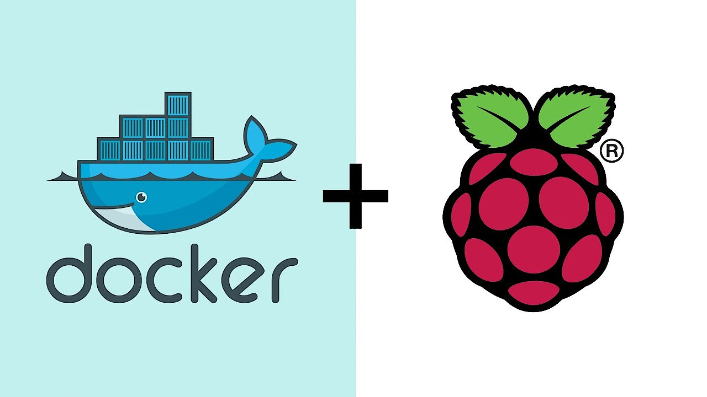

<p align="center"></p>
<h1 align="center"> Docker on a Raspberry Pi </h1> 
<h4 align="right">Ago 25</h4>

<p>
  
  
</p>

<br>

# Table of contents
- [Table of contents](#table-of-contents)
- [Install](#install)
- [Troubleshooting](#troubleshooting)

<br>

# Install
Descarga, instala o actualiza Docker, Docker Compose y Portainer en Raspberry Pi 4 OS Bookworm (64-bit recomendado). Agrega el usuario root  y carjavi al grupo Docker, muestran las IP para acceder a Portainer desde Ethernet y WiFi.

```bash
sudo su -c 'curl -fsSL https://raw.githubusercontent.com/carjavi/docker-RPi/main/install_docker_portainer.sh | bash' 
                       https://raw.githubusercontent.com/carjavi/docker-RPi/main/install_docker_portainer.sh

```
> :memo: **Note:**
> :bulb: **Tip:**


<br>

# Troubleshooting
> :warning: **Warning:**

<br>

---

<div>
  <p>
     Copyright &nbsp;&copy; 2023 Instinto Digital <a href="https://carjavi.github.io/" title="carjavi.github">carjavi</a>
  </p>
</div>

<p align="center">
    <a href="https://instintodigital.net/" target="_blank"></a>
</p>


